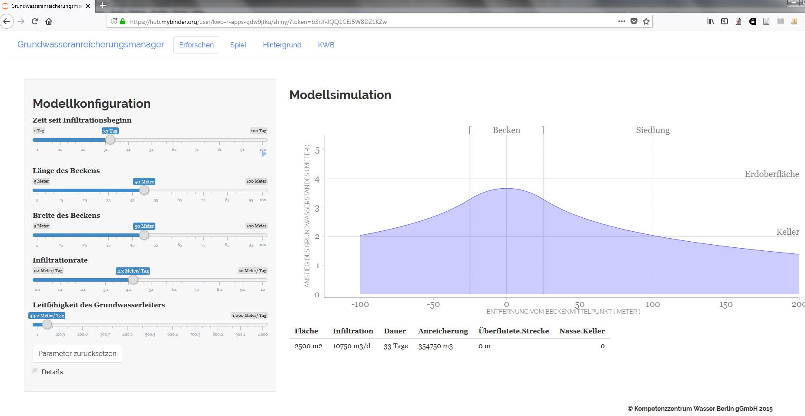
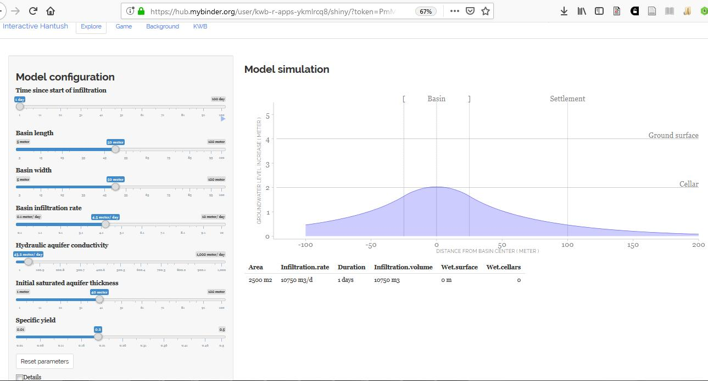

```{r setup, include = FALSE}
knitr::opts_chunk$set(
  collapse = TRUE,
  comment = "#>"
)
```


## 1 Online App

Using the service provided by [mybinder.org](https://mybinder.org), 
the Hantush shiny app (originally developed for the Berlin Long Night of Sciences in the year 2015) can be used online - either in German 
or in English language.

### 1.1 German


**Important note:** in order to see the plot in the tab **Erforschen** (see screenshot below) it is necessary to enable the checkbox **Details** once after starting the app.

[](https://mybinder.org/v2/gh/kwb-r/apps/GWAmanager?urlpath=shiny)
 
[](https://mybinder.org/v2/gh/kwb-r/apps/GWAmanager?urlpath=shiny)


The app`s source code is available [here](https://github.com/KWB-R/apps/tree/GWAmanager).

### 1.2 English

**Important note:** in order to see the plot in the tab **Explore** (see screenshot below) it is necessary to enable the checkbox **Details** once after starting the app.

[](https://mybinder.org/v2/gh/kwb-r/apps/hantush?urlpath=shiny)
 
[](https://mybinder.org/v2/gh/kwb-r/apps/hantush?urlpath=shiny)


The app`s source code is available [here](https://github.com/KWB-R/apps/tree/hantush).


## 2 Offline App 

Using the R function `shiny::runGitHub()` allows to download and run the app locally.

### 2.1 German

```{r eval = FALSE}
shiny::runGitHub("kwb-r/apps", ref="GWAmanager")
```

**Important note:** in order to see the plot in the tab **Erforschen** (see screenshot below) it is necessary to enable the checkbox **Details** once after starting the app.

### 2.2 English

```{r eval = FALSE}
shiny::runGitHub("kwb-r/apps", ref="hantush")
```


**Important note:** in order to see the plot in the tab **Explore** (see screenshot below) it is necessary to enable the checkbox **Details** once after starting the app.
